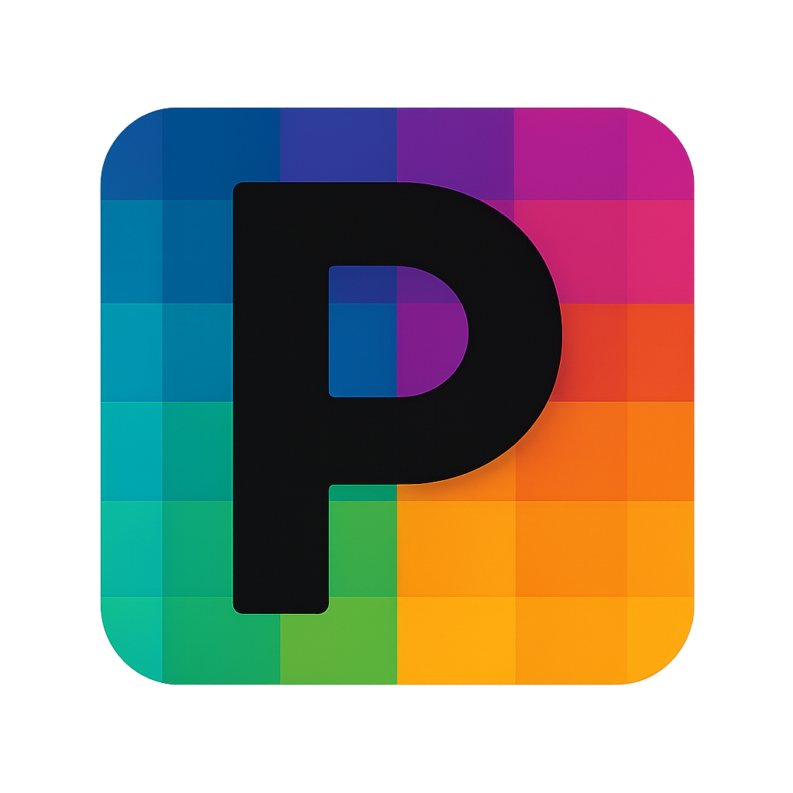

<p align="center">
  
</p>

<h1 align="center">PsPixel</h1>

<p align="center">
  <strong>Professional Pixel Art Editor</strong><br>
  Built with Qt6 &bull; Cross-platform &bull; Open Source
</p>

<p align="center">
  <a href="https://github.com/thejacedev/PsPixel/releases/latest"></a>
  <a href="https://github.com/thejacedev/PsPixel/actions"></a>
  <a href="LICENSE.txt"></a>
  <a href="https://github.com/thejacedev/PsPixel/releases"></a>
</p>

---

## Features

**Drawing Tools** &mdash; Brush, Eraser, Line, Rectangle, Circle, Paint Bucket, Eyedropper, Select/Move. Hold Shift on Rectangle and Circle for filled shapes.

**Layers** &mdash; Add, remove, duplicate, reorder. Per-layer opacity and visibility. Bulk export all layers as individual PNGs.

**Mirror / Symmetry** &mdash; Horizontal and vertical symmetry modes for drawing sprites. Toggle with `Alt+H` / `Alt+V`.

**Canvas Transforms** &mdash; Flip horizontal/vertical, rotate 90 CW/CCW. Canvases up to 4096x4096.

**Undo / Redo** &mdash; Photoshop-style operation history with visual history palette. 50 undo levels.

**Copy / Paste** &mdash; Select a region, `Ctrl+C` to copy, `Ctrl+V` to paste as a movable selection.

**Keyboard Shortcuts** &mdash; Photoshop-style defaults (`B` Brush, `E` Eraser, `V` Select, etc). Fully customizable via Settings menu.

**Auto Updater** &mdash; Checks GitHub releases on startup. One-click download when a new version drops.

**MCP Server** &mdash; AI-driven pixel art creation via Model Context Protocol. Let Claude draw for you.

**Project Files** &mdash; Save/load `.pspx` projects. Export to PNG.

---

## Install

### Download

Grab the latest from [Releases](https://github.com/thejacedev/PsPixel/releases/latest):

| Platform | Package |
|----------|---------|
| Windows | `PsPixel-Setup.exe` or `Portable.zip` |
| Linux | `.AppImage`, `.deb`, `.rpm`, or `.tar.gz` |
| macOS | `.zip` (contains `.app` bundle) |

### Build from source

**Requirements:** Qt6, CMake 3.16+, Ninja

```bash
# Linux (Fedora)
sudo dnf install qt6-qtbase-devel qt6-qtnetwork-devel cmake ninja-build

# Linux (Ubuntu/Debian)
sudo apt install qt6-base-dev libqt6network6 cmake ninja-build

# Then build
git clone https://github.com/thejacedev/PsPixel.git
cd PsPixel
./dev.sh
```

---

## Keyboard Shortcuts

| Key | Tool |
|-----|------|
| `V` | Select / Move |
| `B` | Brush |
| `E` | Eraser |
| `I` | Eyedropper |
| `G` | Paint Bucket |
| `L` | Line |
| `R` | Rectangle |
| `O` | Circle |

| Shortcut | Action |
|----------|--------|
| `Ctrl+Z` | Undo |
| `Ctrl+Y` | Redo |
| `Ctrl+C` | Copy selection |
| `Ctrl+V` | Paste |
| `Ctrl+S` | Save project |
| `Ctrl+E` | Export PNG |
| `Ctrl+Shift+E` | Export all layers |
| `Ctrl+Shift+H` | Flip horizontal |
| `Ctrl+Shift+V` | Flip vertical |
| `Alt+H` | Toggle mirror horizontal |
| `Alt+V` | Toggle mirror vertical |
| `Ctrl+Scroll` | Zoom in/out |
| `Middle Mouse` | Pan canvas |
| `Shift+Drag` | Filled shape (Rectangle/Circle) |

All shortcuts are customizable via **Settings > Keyboard Shortcuts**.

---

## MCP Server

The `mcp/` directory contains a Model Context Protocol server that lets AI assistants create pixel art programmatically.

```bash
cd mcp
npm install
npm run dev
```

**16 tools available:** `create_project`, `draw_pixel`, `draw_line`, `draw_rect`, `draw_circle`, `flood_fill`, `clear_canvas`, `add_layer`, `set_active_layer`, `list_layers`, `set_layer_visibility`, `set_layer_opacity`, `export_png`, `export_all_layers`, `get_canvas_info`, `list_projects`

Add to your Claude config:
```json
{
  "mcpServers": {
    "pspixel": {
      "command": "node",
      "args": ["path/to/PsPixel/mcp/dist/index.js"]
    }
  }
}
```

---

## Project Structure

```
PsPixel/
├── desktop/          # Qt6 C++ desktop application
│   ├── CMakeLists.txt
│   ├── include/      # Headers (constants, canvas, mainwindow)
│   ├── src/          # Source code
│   │   ├── ui/
│   │   │   ├── tools/    # Drawing tools (brush, eraser, line, etc)
│   │   │   ├── layers/   # Layer system
│   │   │   ├── history/  # Undo/redo
│   │   │   ├── start/    # Start screen
│   │   │   └── top/      # Dialogs (save, keybinds, updater)
│   │   └── fileformat/   # .pspx project format
│   └── assets/           # Icons (Lucide)
├── mcp/              # MCP server for AI integration
└── dev.sh            # Build & run script
```

---

## License

MIT &mdash; see [LICENSE.txt](LICENSE.txt)

---

<p align="center">
  Made by <a href="https://github.com/thejacedev">Jace Sleeman</a>
</p>
